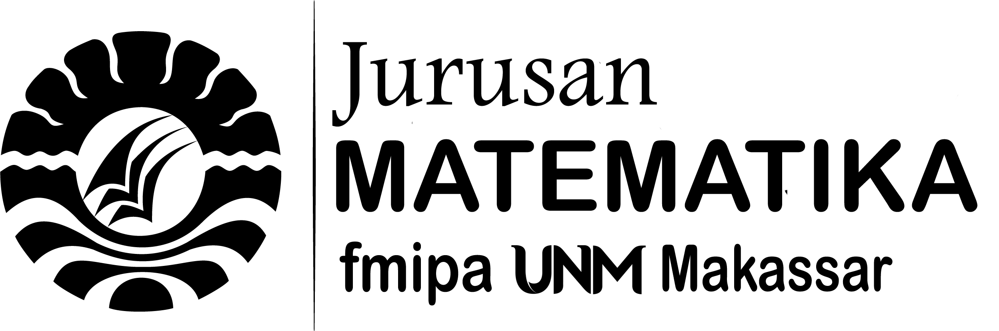
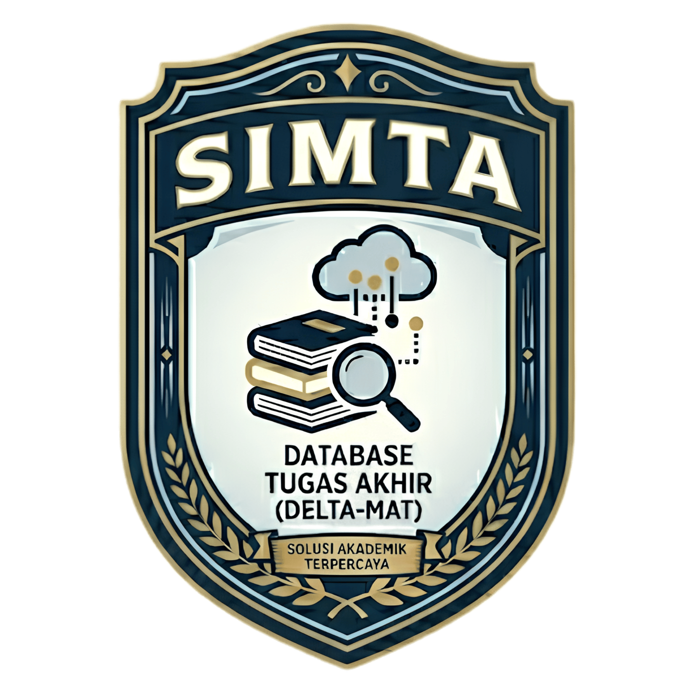

# SIMTA x DELTA-MAT

<p align="center">
  
  &nbsp;&nbsp;&nbsp;
  
</p>

<p align="center">
  <strong>Sistem Informasi Manajemen Tugas Akhir dan Database Referensi DELTA-MAT</strong><br>
  Aplikasi web akademik untuk mengelola bimbingan TA, bimbingan PA, seminar/ujian, repository, dan pembaruan data kolektif.
</p>

<p align="center">
  
  
  
  
</p>

## Ringkasan

SIMTA x DELTA-MAT adalah aplikasi berbasis Laravel untuk membantu alur akademik tugas akhir. Mahasiswa, dosen, dan admin masuk melalui portal sesuai peran, lalu mengakses fitur bimbingan, jadwal seminar/ujian, dokumen, repository, laporan, dan pengelolaan database.

README ini tidak memuat kredensial, token, konfigurasi `.env`, atau data sensitif. Gunakan `.env.example` sebagai template konfigurasi lokal.

## Fitur Dengan Logo

<table>
  <tr>
    <td width="120" align="center">
      
    </td>
    <td>
      <strong>Bimbingan TA</strong><br>
      Pengajuan pembimbing/penguji, approval admin dan dosen, monitoring progress, catatan bimbingan, upload dokumen PDF, seminar/ujian, dan penilaian.
    </td>
  </tr>
  <tr>
    <td width="120" align="center">
      
    </td>
    <td>
      <strong>Bimbingan PA</strong><br>
      Penetapan dosen PA, konsultasi akademik, catatan IPK/SKS, status konsultasi, rekomendasi dosen, dan progress bimbingan PA.
    </td>
  </tr>
  <tr>
    <td width="120" align="center">
      
    </td>
    <td>
      <strong>DELTA-MAT</strong><br>
      Database judul tugas akhir, pencarian referensi, tautan dokumen, pengecekan kemiripan judul, dan pengelolaan data judul oleh admin.
    </td>
  </tr>
</table>

## Modul Aplikasi

- **Portal per peran**: admin, dosen, dan mahasiswa diarahkan ke halaman masing-masing setelah login.
- **Profil pengguna**: data akun, data akademik, foto profil, dan ubah password.
- **Seminar/Ujian**: admin menjadwalkan seminar/ujian; dosen melihat dokumen mahasiswa dan memberi penilaian melalui modal responsif.
- **Repository TA**: daftar dokumen tugas akhir yang dapat dipantau dosen dan mahasiswa sesuai hak akses.
- **Export CSV**: admin dan dosen dapat mengunduh laporan progress bimbingan TA/PA.
- **Update Database Kolektif**: admin dapat bulk insert/update data DELTA-MAT, mahasiswa, dan dosen dari CSV/XLSX dengan history perubahan.

## Teknologi

| Bagian | Stack |
| --- | --- |
| Backend | Laravel, PHP, Eloquent/Query Builder |
| Frontend | Blade, CSS modular, Vite |
| Database | MySQL untuk deployment, SQLite opsional untuk development |
| File storage | Laravel public disk dan storage symlink |
| Testing | PHPUnit melalui `php artisan test` |

## Struktur Penting

```text
app/Http/Controllers     Controller utama aplikasi
app/Models               Model Eloquent
database/migrations      Skema database
database/seeders         Seeder data awal
resources/views          Blade template
resources/css            CSS per halaman/modul
routes/web.php           Route web aplikasi
assets                   Logo fitur dan aset visual README/landing page
```

## Instalasi Lokal

```bash
composer install
npm install
cp .env.example .env
php artisan key:generate
```

Atur koneksi database pada `.env` lokal, lalu jalankan:

```bash
php artisan migrate --seed
php artisan storage:link
npm run build
php artisan serve
```

Untuk mode development frontend:

```bash
npm run dev
```

## Docker

Jika memakai konfigurasi Docker project:

```bash
docker compose up --build
```

Perintah umum di container:

```bash
docker compose exec app php artisan migrate --seed
docker compose exec app php artisan test
docker compose run --rm vite npm run build
```

## Update Database Kolektif

Menu admin: **Update Kolektif**.

Format file:

- CSV atau XLSX.
- Baris pertama wajib berupa header kolom.
- File `.xls` lama perlu disimpan ulang sebagai `.xlsx` atau `.csv`.

Mode update:

- **Update data yang lama**: data lama diperbarui jika key unik ditemukan, data baru tetap ditambahkan.
- **Jangan ganggu data yang lama**: hanya menambah data baru, data lama tidak diubah.

Key unik:

| Target | Key |
| --- | --- |
| DELTA-MAT | `nim` + `title` |
| Mahasiswa | `nim` |
| Dosen | `nip`, dengan `nidn` sebagai pendukung pencocokan data lama |

Setiap data baru atau perubahan field dicatat di tabel `update_histories` dengan waktu, user admin, target tabel, mode aksi, dan nilai lama/baru.

## Perintah Quality Check

```bash
php artisan test
npm run build
php artisan optimize:clear
```

## Keamanan dan Data Sensitif

- Jangan commit file `.env`, credential database, token API, backup database, atau file upload privat.
- Gunakan `.env.example` untuk template konfigurasi.
- Gunakan `php artisan storage:link` agar file publik dapat diakses melalui mekanisme Laravel.
- Hindari `php artisan migrate:fresh --seed` pada database yang berisi data penting karena perintah tersebut menghapus tabel sebelum membuat ulang data.

## Catatan Pengembangan

- CSS dipisah per halaman/modul agar Blade tidak penuh style inline.
- Route lama yang sudah diarahkan ulang tetap dipertahankan untuk kompatibilitas.
- File kandidat tidak terpakai sebaiknya dicek referensinya terlebih dahulu sebelum dihapus.
